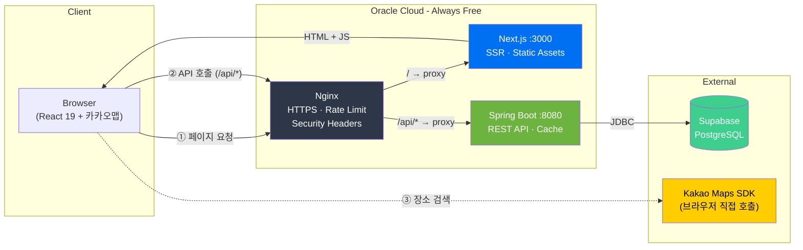
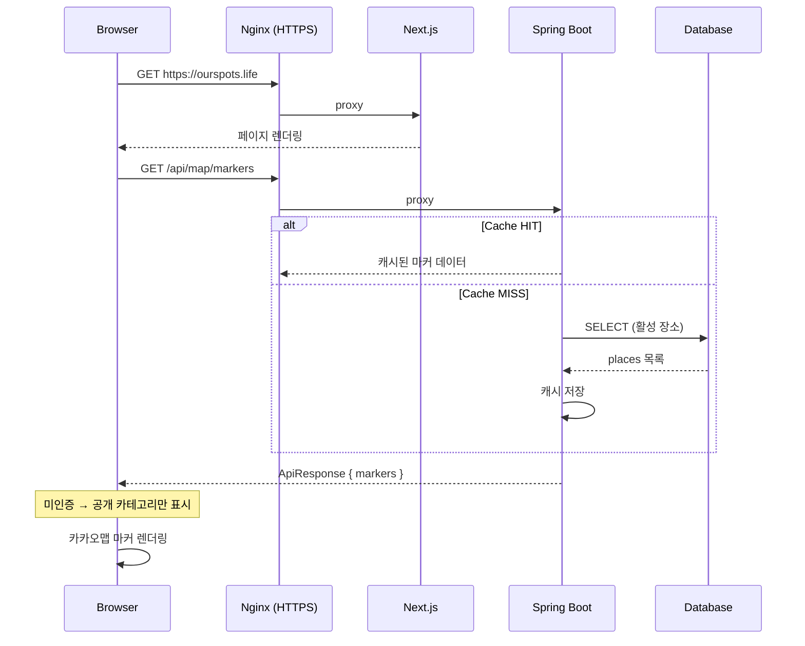
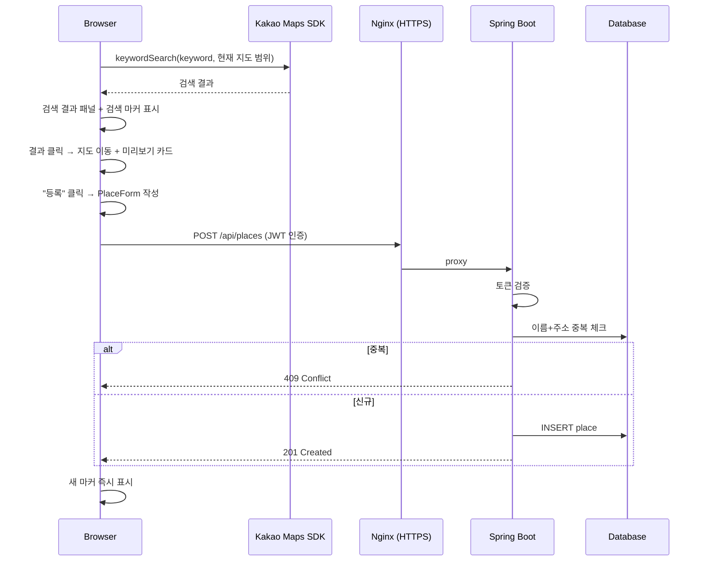

# Our Spots API

> 우리 가족의 맛집/명소 추천 서비스 — 백엔드 API

가족이 함께 다녀온 맛집, 아이 놀이터, 추천 명소를 지도 위에 기록하고 공유하는 서비스의 REST API 서버입니다.

## Tech Stack


| 분류 | 기술 |
|------|------|
| Language | Kotlin 1.9, Java 17 |
| Framework | Spring Boot 3.5, Spring Data JPA |
| Database | PostgreSQL (Supabase) |
| Cache | Caffeine (Spring Cache) |
| Auth | JWT (jjwt), Custom Interceptor |
| Test | JUnit 5, MockK, H2 |
| Build | Gradle (Kotlin DSL) |

## 주요 기능

- 장소 CRUD (맛집, 아이 놀이터, 아빠의 시간, 나의 발자취, 추천 맛집, 추천 명소)
- 지도 마커 API (바운딩 박스 영역 조회, Caffeine 캐시)
- JWT 관리자 인증 (IP 기반 Rate Limiting)
- 개인 카테고리 서버측 필터링 (미인증 시 공개 타입만 응답)
- Soft Delete (삭제 시 `deletedAt` 기록, 조회 시 자동 제외)
- 배치: 엑셀 장소 일괄 등록, Google Places 평점 동기화, DB 백업(CSV)

## API

| Method | Endpoint | 설명 | 인증 |
|--------|----------|------|:---:|
| GET | `/api/places` | 장소 목록 | - |
| GET | `/api/places/{id}` | 장소 상세 | - |
| POST | `/api/places` | 장소 생성 | 🔒 |
| PUT | `/api/places/{id}` | 장소 수정 | 🔒 |
| DELETE | `/api/places/{id}` | 장소 삭제 | 🔒 |
| GET | `/api/map/markers` | 지도 마커 | - |
| POST | `/api/map/markers/refresh` | 마커 캐시 갱신 | 🔒 |
| POST | `/api/auth/login` | 관리자 로그인 | - |

## 실행 방법

### 사전 준비

- Java 17+
- PostgreSQL (또는 Supabase)

### 환경변수

프로젝트 루트에 `.env` 파일 생성:

```env
DATABASE_URL=jdbc:postgresql://<host>:<port>/<database>
DATABASE_USERNAME=<username>
DATABASE_PASSWORD=<password>
ADMIN_PASSWORD=<admin_password>
JWT_SECRET=<min_32_characters>
```

### 실행

```bash
git clone https://github.com/tjddn88/our-spots-api.git
cd our-spots-api
./gradlew bootRun --args='--spring.profiles.active=local'
```

서버가 `http://localhost:8080`에서 실행됩니다.

### 테스트

```bash
./gradlew test
```

## 프로젝트 구조

```
src/main/kotlin/com/ourspots/
├── api/           # Controller, DTO
├── batch/         # 배치 (엑셀 등록, Google 동기화, DB 백업)
├── domain/
│   ├── auth/      # JWT 인증, Rate Limiting
│   └── place/     # 장소 CRUD
├── common/        # 예외 처리, 응답 래퍼
└── config/        # CORS, Cache, JWT 인터셉터
```

## 아키텍처



**배포 구성:**
- **서버**: Oracle Cloud ARM (Ubuntu 22.04), systemd로 프로세스 관리
- **SSL**: Let's Encrypt (certbot 자동 갱신)
- **배포**: SSH → git pull → build → systemctl restart
- **보안**: nginx Rate Limiting → fail2ban IP 차단 → App 레벨 Rate Limiting (3중 방어)

## 앱 플로우

### 초기 로딩 → 마커 표시



### 장소 검색 → 등록



## 관련 프로젝트

- [our-spots-web](https://github.com/tjddn88/our-spots-web) — 프론트엔드 (Next.js)
